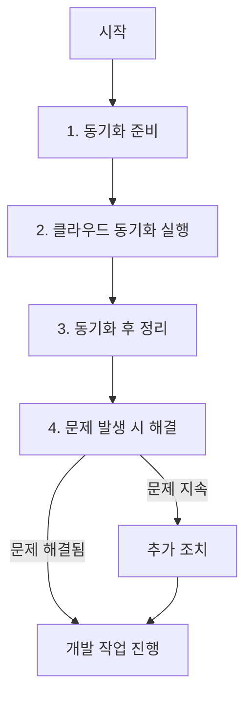

# 클라우드 동기화 과정 가이드

이 문서는 Typing Stats 앱을 클라우드 스토리지와 함께 사용할 때의 동기화 과정을 단계별로 설명합니다.

## 동기화 작업 흐름

클라우드 스토리지(Google Drive, Dropbox 등)와 개발 프로젝트의 동기화 과정은 다음과 같은 단계로 진행됩니다:



## 1. 동기화 준비 단계

동기화 준비는 `npm run sync:prepare` 명령을 통해 수행됩니다.

### 수행되는 작업:

1. **클라우드 동기화 제외 목록 설정**
   - `node_modules`, `native-modules/target`, `.next`, `out`, `dist`, `.git` 등 큰 폴더들이 제외됩니다.

2. **.gdignore 파일 생성**
   - Google Drive 동기화에서 제외할 폴더를 지정합니다.
   - 생성된 파일 형식:
     ```
     # Google Drive 동기화 제외 설정
     node_modules/
     native-modules/target/
     .next/
     out/
     dist/
     .git/
     ```

3. **Rust 빌드 아티팩트 정리**
   - `native-modules/target` 디렉토리가 있다면 `cargo clean` 명령을 실행합니다.

4. **.gitignore 파일 업데이트**
   - 필요한 항목(Rust 관련 파일 등)이 모두 포함되어 있는지 확인합니다.

## 2. 클라우드 동기화 실행

이 단계는 클라우드 동기화 서비스(Google Drive, Dropbox 등)를 통해 자동으로 수행됩니다.

### 주의사항:

- 동기화 과정은 클라우드 서비스의 클라이언트 프로그램에 의해 관리됩니다.
- 큰 파일들은 `.gdignore`를 통해 제외되어야 합니다.
- 동기화 중에는 프로젝트 파일을 수정하지 않는 것이 좋습니다.

## 3. 동기화 후 정리

동기화가 완료된 후 `npm run sync:cleanup` 명령을 실행합니다.

### 수행되는 작업:

1. **npm 캐시 정리**
   - `npm cache clean --force` 명령으로 캐시를 정리합니다.

2. **Git 저장소 정리**
   - `git gc` 명령으로 저장소를 최적화합니다.
   - `git fsck` 명령으로 저장소 무결성을 검사합니다.

3. **임시 파일 정리**
   - `.cache`, `.npm`, `.eslintcache` 등의 임시 폴더를 제거합니다.

## 4. 문제 발생 시 해결

동기화 후 문제가 발생하면 다음 명령을 사용하여 해결할 수 있습니다:

### npm 관련 문제

의존성 패키지가 손상된 경우:

```bash
npm run sync:fix-npm
```

이 명령은 다음 작업을 수행합니다:
- npm 캐시 완전 정리 (`npm cache clean --force`)
- 패키지 잠금 파일 없이 의존성 재설치 (`npm ci --no-package-lock`)

#### NPM TAR_ENTRY_ERROR / EBADF 오류 해결

다음과 같은 오류가 발생하는 경우:
```bash
npm ERR! code TAR_ENTRY_ERROR
npm ERR! errno -4048
npm ERR! syscall open
npm ERR! EBADF: bad file descriptor, open
```

해결 방법:
1. `npm cache clean --force` 명령을 실행하여 npm 캐시를 완전히 정리합니다.
2. `npm install --no-package-lock` 명령을 실행하여 패키지를 다시 설치합니다.

### Git 관련 문제

Git 저장소에 문제가 있는 경우:

```bash
npm run sync:fix-git
```

이 명령은 다음 작업을 수행합니다:
- Git 가비지 컬렉션 (`git gc`)
- Git 파일 시스템 점검 (`git fsck`)

## 모범 사례

### 다중 기기 작업 시 권장사항

1. **작업 시작 전 항상 준비 과정 실행**
   ```bash
   npm run sync:prepare
   ```

2. **작업 완료 후 항상 정리 과정 실행**
   ```bash
   npm run sync:cleanup
   ```

3. **각 기기에서 독립적으로 의존성 설치**
   ```bash
   npm install
   ```

4. **큰 파일이나 빌드 아티팩트는 동기화하지 않기**
   - 중요한 설정만 동기화하고, 빌드는 각 기기에서 새로 수행하세요.

5. **한 번에 한 기기에서만 작업하기**
   - 충돌을 방지하려면 여러 기기에서 동시에 같은 파일을 편집하지 마세요.

## 트러블슈팅 가이드

### 빌드 오류 발생 시

1. 네이티브 모듈 빌드 오류:
   ```bash
   npm run build:native:debug
   ```

2. 의존성 문제:
   ```bash
   npm ci --legacy-peer-deps
   ```

### 파일 손상 문제

1. 파일이 손상된 경우:
   - Git을 사용하는 경우: `git restore <파일명>`
   - Git을 사용하지 않는 경우: 클라우드 스토리지의 이전 버전에서 복원

### 동기화 충돌

1. `.git` 폴더가 동기화되어 문제가 발생한 경우:
   - 프로젝트를 새로 클론하고 변경사항을 수동으로 적용하는 것이 안전합니다.

## 결론

클라우드 동기화와 개발 환경을 함께 사용할 때는 위의 작업 흐름을 따르는 것이 중요합니다. 특히 큰 빌드 아티팩트를 제외하고, 정기적인 준비/정리 과정을 수행함으로써 대부분의 문제를 예방할 수 있습니다.
